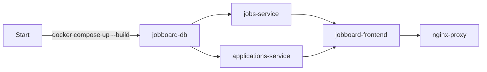

## Task 1 - Dockerfile Hardening

### Findings during setup
- `applications-service` and `frontend` were missing `package-lock.json`,
  which `npm ci` requires. Fixed with `npm install` to generate it.
- eserver -> server typo.
- Double FROM FROM at one of the dockerfiles. - A bug I created and fixed (not from the original file).

### Task 1.1 - Vulnerability Scanning

**How many CRITICAL CVEs did you find in total across all images?**

There were 5 CRITICAL CVEs in total across all images:
- 1 CRITICAL CVE in `trivy-applications-service.txt` (CVE-2026-59873) — Node.js
- 4 CRITICAL CVEs in `trivy-jobs-service.txt` (CVE-2026-13221, CVE-2026-42496, CVE-2026-57433, CVE-2026-8376) — jobs-service:latest

**Which image has the most vulnerabilities?**

- `jobs-service:latest` - 171 (Debian OS layer)
- `jobs-service:latest` - 13 (Python packages)
- `applications-service:latest` - 26 (Node.js packages)
- `frontend` - 0
- `nginx-proxy` - 0

The single image with the most vulnerabilities is `jobs-service:latest` with 184 vulnerabilities.

**Pick one CRITICAL CVE and explain: (a) what it is, (b) which package it affects, (c) what the fix/mitigation is**

**CVE Picked: CVE-2026-42496 (Archive::Tar / perl-base)**

This CVE indicates a vulnerability in `Archive::Tar` versions prior to 3.08, which fail to properly validate symlink targets during TAR extraction. A symlink can be viewed as a shortcut. A correctly implemented extractor must ensure that every file written during extraction stays confined within the chosen destination directory. The bug is that older versions don't check where symlinks inside the archive actually point.

An attacker can exploit this as follows: they craft a malicious TAR archive containing a symlink (e.g., named `shortcut`) that points to a sensitive system location (e.g., `/etc` or `System32`). The same archive also contains a regular file whose path is `shortcut/malicious_config.conf`. During extraction, the tool blindly follows the symlink and writes the malicious file directly into the sensitive directory — resulting in an arbitrary file write outside the intended extraction path. If the attacker overwrites something like a password file or a startup script, this can lead to full system compromise once the OS later reads or executes that file.

**Affected package:** `perl-base` (Debian), specifically the `Archive::Tar` Perl module
**Installed version:** 5.40.1-6 | **Severity:** CRITICAL | **Status (Debian tracker):** `fix_deferred`

**The Fix/Mitigation:** First, I checked whether the vulnerability is actually exploitable. I verified that `Archive::Tar` is not loadable in the image, confirming the module is not shipped with `perl-base` here:

```
$ docker run --rm jobs-service:latest perl -MArchive::Tar -e 'print $Archive::Tar::VERSION'
Can't locate Archive/Tar.pm in @INC
```

This means Trivy flags this CVE at the Debian source-package level, but the actual vulnerable module is not physically present here — **this CVE is not exploitable in this image**.

**Recommendations if it was exploitable:**
According to Red Hat, no mitigation is currently available for this CVE, and Debian's own tracker shows `fix_deferred` — no patched `perl-base` package has been released yet, so a simple `apt upgrade` cannot fix this today. If possible, removing `perl-base` would be the best fix.

In this image case - I validated this removal earlier with `apt-get remove -s perl-base`. 
(Debian marks it "Essential", but only perl-base itself was removed, no other packages depended on it). This is a static Image that never runs `apt install/upgrade` after building, so the essential risk isn't present in this specific case.

### Task 1.2 - Harden The Dockerfiles
- Ensured all final images run on non-root users:
    - At first, the directory creation failed due to permission deny. the root cause was that var/run/ is a symlink to run/. fixed CHOWN to just run/
- Pinned all FROM tags to an exact digest
- added 1 .dockerignore file at /nginx
- corrected 1 HEALTHCHECK port from 80 to 8080
- Verified: Dockerfiles already chain RUN commands with && — no changes needed

#### Sizes Table Comparsion:
| Service     | Before Hardening Size | After Hardening Size |
|-------------|-----------------------|----------------------|
| nginx-proxy | 97.7 MB               | 97.7 MB              |
| frontend    | 98 MB                 | 98 MB                |
| jobs-service| 274 MB                | 274 MB               |
|application-service|    223 MB       | 223 MB               |

From this table we can see that the Hardening changes made didn't affect the sizes of the images. this makes sense as these are security enhancments and not sizing enhancments. CHOWN doesn't add many BYTES, USER is a metadata, Digest doesn't change the image content and the RUN was already right configured and no changes were needed. 

## Task 2 - Docker Compose Orchestration
### Task 2.1 - Logging configuration
Added logging to 5 services
### Task 2.2 - Environment variable isolation
**Default Secret Handling**
- The original `docker-compose.yml` file had a plain secret within: jobboard123 as a postgresql default password. - this is a security risk due to the fact that the `docker-compose.yml` file uploads to Git. 
- The first check I made succeeded running the system with a "weak" password (Not failed as expected)
- After deleting the plain default password, the recheck gave a confusing result: the service still run successfully and listened for requests.
    - I Understood that this is due to the previous build - The Postgresql was initiated to an old volume that was created at the previous test. it seems that Postgres doesn't recheck for password for an existing data.
- After running `docker compose down -v` (Deletion of the volume) and a clean new run - Postgres failed to load with a clear error message, then entered a restart loop (just as requested in the YML file)

**Explain why committing .env to git is a security risk and what tools exist to prevent it (e.g., git-secrets, truffleHog, GitHub secret scanning).**
committing .env to git exposes local environment variables to git - some of which might be secrets (like plaintext credentials, API Keys, etc.), and all of them should stay local. Yet, the real issue is that while it is in Git, the information within the `.env` will be permanently logged and the file can be accessed to anyone with repository access even after fixing the issue due to the history recording. to mitigate this risk, add `.env` file to gitignore, commit a `env.example` file with no private information instead,or use native host-provider secrets and use secret detection and scanning tools like the ones stated in the question:
- Git-Secrets (By AWS): A tool to install on the computer, and sets up a "pre-commit hooks". every `git commit` command, it scans the code for AWS keys or patterns pre-defined. This will block the commit entirely if it finds a secret
- TruffleHog: A deep-history scanning tool. It searches through the entire Git repository, including past branches and commit messages. it also verifies the secrets against live API to see if the secret is active.
- GitHub secret scanning: a cloud based scanning service integrated directly into GitHub. Whenever code is pushed to GitHub, their automated backend scans the push for known token formats from hundreds of service providers (like Stripe, Slack, AWS). If it finds a public leak, it immediately notifies you.
### Task 2.3 - Service restart policy and dependency ordering
**Sequence Diagram for startup order**

**As ASCII ART**
            jobboard-db
                |
        |-------|---------|
        v                 v
   jobs-service   applications-service
        |                 |
        |--------|--------|
                 |
                 v
        jobboard-frontend
                 |
                 v
            nginx-proxy
**condition: service_healthy vs condition: service_started**
service_started - waits for the dependency container to start running. It does not check what is happening inside the container. 
service_healthy - pauses the startup until the dependency passes its defined internal health check.

**PostgreSQL Failure Test**
1. `docker stop jobboard-db` - postgres actually goes down (confirmed via `docker ps -a`, showing `Exited (0)`).
2. `docker compose ps` still shows jobs-service and applications-service as "healthy" - misleadingly.
    - The reason: their healthcheck only tests `/health`, which is a shallow liveness check ("is the server process itself running") - it never actually tests the database connection.
    - Proof: calling `/jobs` directly (an endpoint that genuinely requires the DB) returns HTTP 500, while the healthcheck stays green the entire time.
    - Testing: testing this through the public nginx-proxy route is unreliable, because of the pre-existing redirect bug (trailing-slash mismatch) discovered earlier
3. General conclusion - a green healthcheck does not necessarily mean the service is fully functional - it only reflects whatever the check script actually tests. A shallow healthcheck (just "is the process alive") gives false confidence when a critical dependency (like the database) goes down. - The check might need to also test connectivity (or any other essential working condition)
4. Recovery - after `docker start jobboard-db`, `jobs-service` self-healed automatically — no restart needed. This suggests its DB driver opens a fresh connection per request rather than holding a single broken connection open, which is a good resilience trait worth noting separately.

## Task 3 - Data Persistence & Backup.
### Task 3.1 - Verify persistence across restarts.
- A new job was created with `POST /api/jobs`, it got a unique ID.
- docker compose restart postgres (without volume deletion with `down -v`)
- `GET /api/jobs/` after restart - the Job still exists.
The data live inside `jobboard-postgres-data` which is a named volume. it doesn't delete with `restart/stop/start`, only with `down -v`
**Explain the difference between docker compose down, docker compose down -v, and docker compose stop. When would you use each?**
- docker compose stop: Pauses containers. Preserves everything.
    -When to use it:
        - Taking a quick break from coding.
        - Restarting your computer without losing container states.
        - Temporarily freeing up CPU and RAM.
- docker compose down: Removes containers and networks. Preserves volumes.
    -When to use it:
        - Switching to a different project.
        - Updating image versions in your docker-compose.yml file.
        - Cleaning up your active container list to avoid naming conflicts.
- docker compose down -v: Removes containers, networks, and all data volumes.
    -When to use it:
        - Resetting a database to a completely blank slate.
        - Fixing corrupted local data during development.
        - Testing fresh application installation scripts.
### Task 3.2 - Volume inspection
**Where on the host machine is the data actually stored?**
Mountpoint: /var/lib/docker/volumes/jobboard-postgres-data/_data

Due to the host OS (Windows), this is not a literal path on my Windows filesystem. Docker Desktop runs a lightweight Linux VM in the background.
All containers and volumes actually live inside that VM — the path above is real, but only inside the VM's own filesystem, not reachable directly from Windows Explorer without going through `\\wsl$\docker-desktop-data\...`.
On native Linux, there's no VM at all — Docker Engine runs directly on the host kernel, so this same path would be a real, directly browsable directory on the actual disk (with sudo, since it's root-owned).

**What is the difference between a named volume (postgres-data:) and a bind mount (./data:/var/lib/postgresql/data)?**
|          Aspect          |                                Named Volume                                |                               Bind Mount                               |
|:------------------------:|:--------------------------------------------------------------------------:|:----------------------------------------------------------------------:|
| Who manages the location | Docker itself                                                              | Me, manually (explicit host path)                                     |
| Portability              | Identical behavior across Windows/Mac/Linux                                | Host-path-dependent, behaves differently per OS                        |
| Performance              | Faster for write-heavy workloads (stays inside the VM boundary on Desktop) | Often slower on Windows/Mac (crosses the VM-to-host translation layer) |
| Direct host access       | Deliberately harder (by design)                                            | Easy — just open the folder                                            |
| Security                 | Contained within Docker's managed area                                     | Container gets direct read/write to an arbitrary host path             |

**When would you prefer each approach in production?**
- Named Volumes: for data the application itself manages and nobody needs to touch by hand - databases (like postgres), queues, persistent caches. We want Docker/the orchestrator to own the lifecycle, best performance, and access mediated through the app or backup tooling.
- Bind mounts: for config files injected from outside (like owned nginx.conf), or dev workflows (live code reload), or when external tooling needs direct file access.
- Kubernetis docs recommends against host path in production because it's non-portable and considered risky. 

### Task 3.3 - Database backup and restore
**Restore procedure for a backup .sql file:**
Backup Creation:
```
docker exec jobboard-db pg_dump \
  -U postgres \
  -d jobboard \
  --no-owner \
  --no-acl \
  -F plain > backup_$(date +%Y%m%d_%H%M%S).sql
```

Backup Restore:
```
docker run -d --name postgres-restore-test \
  -e POSTGRES_USER=postgres \
  -e POSTGRES_PASSWORD=testpass \
  -e POSTGRES_DB=jobboard \
  postgres:16-alpine

sleep 5
docker cp backup_*.sql postgres-restore-test:/tmp/backup.sql
MSYS_NO_PATHCONV=1 docker exec -it postgres-restore-test psql -U postgres -d jobboard -f /tmp/backup.sql
```
Remark: `MSYS_NO_PATHCONV=1` is Windows/Git Bash specific addition. it is unnecessary to run this command in other environments On Mac or Linux

## Task 4 - CI/CD Pipeline with GitHub Actions

Task 4 was removed from this assignment's README by the instructor (confirmed directly). Not attempted for that reason but will be resolved later.

## Task 5 - Networking & Service Communication
### Task 5.1 - Understand the Docker network
**List all containers on the network with their IP addresses**
- jobboard-network is the network with subnet 172.18.0.0/16
- jobboard-frontend = 172.18.0.6
- nginx-proxy=172.18.0.2
- applications-service=172.18.0.3
- jobs-service=172.18.0.4
- jobboard-db=172.18.0.5

**Explain how jobs-service resolves the hostname postgres (Docker's embedded DNS)**
A container service resolves the hostname `postgres` by sending DNS queries to Docker's internal embedded DNS server located at the fixed IP address `127.0.0.11` inside the container's network namespace.
1. When a container connects to a user-defined custom network, Docker configures the container's internal `/etc/resolv.conf` file to point nameserver strictly to `127.0.0.11`.
2. This IP address is not a physical network card. Instead, transparent `iptables` rules inside the container intercept any outgoing network traffic on UDP/TCP port 53 (DNS) and route it directly to the Docker daemon’s internal DNS resolver.
3. The Docker daemon keeps a real-time, internal database mapping container names, service names (like `postgres`), and network aliases to their respective dynamic container IP addresses on that specific network. When your application queries `postgres`, the daemon matches the name and returns the internal IP address (e.g., `172.18.0.5`)
4. If the embedded DNS server cannot match the requested name to an active container on the local user-defined network, it transparently forwards the request upstream to any external DNS servers configured on the host system.

**What happens if you try to reach jobs-service:8000 from your browser directly? Why?**
- DNS: The container name resolves only by the internal Docker DNS resolver, which is available only to other containers in the network. The browser, running on the host OS (In my case - Windows) can't ask the internal Docker DNS to resolve the name of the container - because it down't know that the Docker resolver exists at all.
- Network routing: Even without DNS, by using the direct IP Address of the containers is not possible, because the container network lives in the Docker VM. The OS physically isn't connected to that network in the routing level.
- The solution: nginx-proxy serves as the reverse proxy, allowing connection from localhost and routing it to the network.

### Task 5.2 - Inter-service communication test

```
# From the jobs-service container, reach postgres
docker exec -it jobs-service python3 -c "
import psycopg2
import os
conn = psycopg2.connect(os.environ['DATABASE_URL'])
print('Connected to PostgreSQL:', conn.get_dsn_parameters())
conn.close()
"
 
 Connected to PostgreSQL: {'user': 'postgres', 'channel_binding': 'prefer', 'dbname': 'jobboard', 'host': 'postgres', 'port': '5432', 'options': '', 'sslmode': 'prefer', 'sslcompression': '0', 'sslcertmode': 'allow', 'sslsni': '1', 'ssl_min_protocol_version': 'TLSv1.2', 'gssencmode': 'prefer', 'krbsrvname': 'postgres', 'gssdelegation': '0', 'target_session_attrs':'any', 'load_balance_hosts': 'disable'}
```

### Task 5.3 - Nginx routing analysis
**trace the full journey of the `Browser → POST http://localhost/api/applications/` request**
Browser -> nginx -> applications-service -> nginx -> browser

**Which nginx `location` block matches?**
In the file `nginx/nginx.conf` there is a line stating `location /api/applications` - this matches every request that starts with `/api/applications`.

**What the `rewrite` rule transforms the path to?**
In the same file, there is a line stating: `rewrite ^/api/applications/(.*) /applications/$1 break;` - It takes what comes after `/api/applications/` and rewrites it to `/applications/`.

**Which upstream container receives the request and on which port?**
There is also this line:
`upstream applications_service { server applications-service:3001;}`
The rerouted request is sent to a `container` named `applications-service` with port 3001.

**How the response travels back to the browser?**
`applications-service` returns a `201 Created` with the newly created JSON of the application. Nginx then transfers it to the browser. 

## Task 6 - Security Hardening
### Task 6.1 - Use Docker secrets
- Created a docker secret file, named `db_password.txt`, and updated `POSTGRES_PASSWORD_FILE` on postgres. rebind the Postgres URL call in both Python jobs-service and JS Node applications-service to build dynamically.
- Interesting finding: The password contained the char `@`, which broke the DNS parsing. Fixed this issue with URL-encoding
- Since the DB was already connected, to check if this run smoothly, I had to use `docker compose down -v` before the new secret actually took effect.

### Task 6.2 - Add Content Security Policy headers
**Document your CSP**
```
$ curl -sI http://localhost | grep -i content-security
Content-Security-Policy: script-src 'self'; style-src 'unsafe-inline' 'self'; frame-ancestors 'none';
```
- script-src 'self' - only allow JS from the same origin.
- style-src 'self' 'unsafe-inline' - CSS from same origin plus inline styles.
- frame-ancestors 'none' - nobody can embed this page in an iframe, which is the main defense against clickjacking.

## Screenshots

**Application running at `http://localhost`:**


**`docker compose ps` - all containers healthy:**

